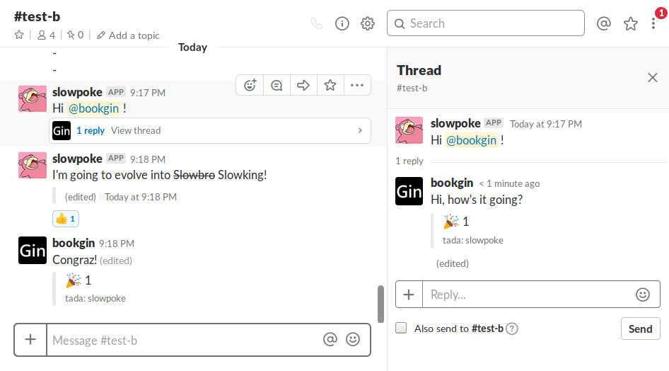

# SlackPortal

SlackPortal: Create a share channel for your Slack workspaces

## Description

You can use SlackPortal to create a share channel between two different workspaces. All the message, thread, editing, mention and emoji will be synced in the channel.



## Installation

```sh
git clone https://github.com/bookgin/slackportal
cd slackportal
npm install @slack/client

# Then edit config.js to specify the tokens

node index.js
```

## Get API Tokens

1. Create a new slack app in [https://api.slack.com/apps](https://api.slack.com/apps).
2. App name can be arbitrary. Choose one of the workspaces you want to use SlackPortal.
3. Navigate to "Add features and functionality": Select "Bots" and then "Add a Bot User"
4. Both display name and default username can be arbitrary.
5. Click "Add a Bot User" and then "Save Changes"
6. Navigate to "Add features and functionality": Select "Permissions" and scroll down to Scopes
7. Add the following permission scopes and "Save Changes":
  - channels:history
  - channels:read
  - chat:write:bot
  - chat:write:user
  - reactions:read
  - users:read
8. Scroll up and click "Install App to Workspace"
9. Authorize this app
10. Now you have acquired OAuth Access Token (oauth\_token) and Bot User OAuth Access Token (bot\_token). Specify both tokens in `local_bot_token` and `local_oauth_token` in `config.js`
11. Repeat steps as described above and choose the other workspace in step 2. Specify the tokens in `remote_bot_token` and `remote_oauth_token` in `config.js`.
12. In both channels of workspaces, invite the bot user into the channel.
